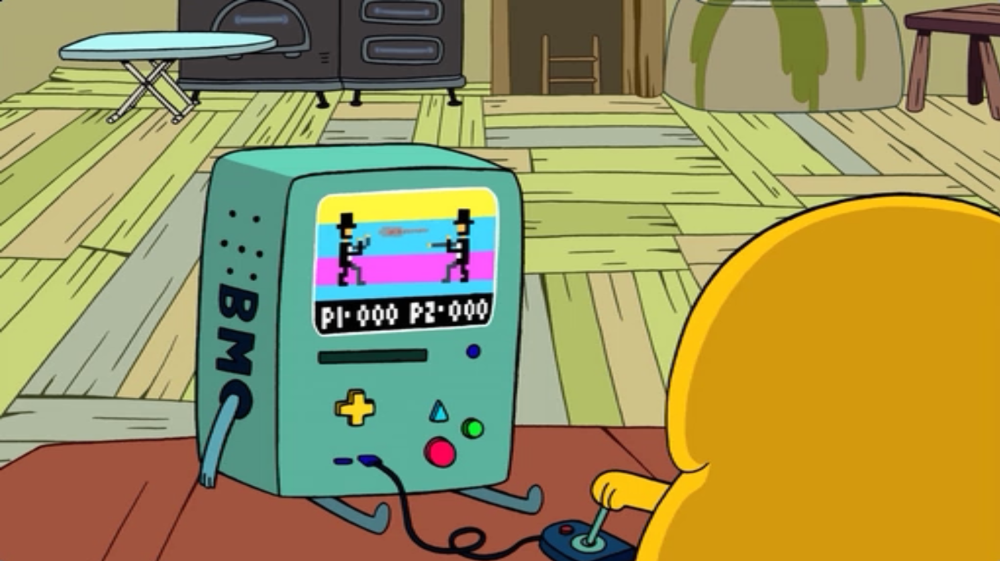

# Cocos2d-x Deconstruction


Emma Bobola & Janna Shaftan

Northeastern University, EECE4850 - Game Engines

Professor: Nik Bear Brown

Spring 2017

## Introduction

This code deconstruction was written for the purpose of learning how game engines are architected. 'Cocos2d-x' and 'Cocos' will be used interchangeably to refer to the game engine. We will review the capabilities and overall architecture of the engine, followed by in depth analyses of several core components of the Cocos game engine.

## Table of Contents

1. [About the Engine](#about-the-engine)
2. [External Dependencies/Libraries](#external-dependencies)
3. [Architecture of Engine Framework](#framework-architecture)
4. [Engine Components](#game-engine-components)

> * [Overview](#component-overview)
> * [Time and the Game Loop](#time-and-game-loop)
> * [Game Objects](#game-objects)
> * [Physics](#physics)
> * [Graphics and Rendering](#graphics-and-rendering)

## About the Engine

* release date
* company
* history
* what the engine offers as compared to older versions
* MIT License
* Cross-Platform:

> * MacOS X
> * Linux
> * Windows 8
> * iOS
> * Android
> * Tizen


## External Dependencies

* Physics ~~~ [Box2D](http://box2d.org/) and [Chipmunk](http://chipmunk-physics.net/)
* Skeleton Animations ~~~ [Spine](http://esotericsoftware.com/) and [Armature](http://www.armaturestudio.com/)
* Sound ~~~ [OpenAL](https://www.openal.org/) based [CocosDenshion library](https://github.com/victorBaro/cocos2d-V2.x-ARC-UIKit/tree/master/cocos2d-2.x-ARC-iOS/libs/CocosDenshion)
* Graphics ~~~ [OpenGL](https://www.opengl.org/)


## Framework Architecture

The Cocos2d Games Architecture:


[https://raw.githubusercontent.com/cocos2d/cocos2d-x/v3/docs/framework_architecture.jpg](https://raw.githubusercontent.com/cocos2d/cocos2d-x/v3/docs/framework_architecture.jpg)

The 'Cocos2d C++ Engine' is the focus of this analysis. We have created a diagram of the C++ Engine sub-component's architecture:

(create image)

## Game Engine Components

Because of the extensive code base, not all components will be covered in this analysis. The Component Overview provides links to where all key components can be found in the Cocos git repository.

### Component Overview

|  |Module|Class or File|Ext. Dependencies|Analyzed|
| ----|----|----|----|----- |
|**Time and Game Loop** | [base](https://github.com/cocos2d/cocos2d-x/tree/v3/cocos/base) | [Director](https://github.com/cocos2d/cocos2d-x/blob/v3/cocos/base/CCDirector.h#L97) - ([mainLoop()](https://github.com/cocos2d/cocos2d-x/blob/v3/cocos/base/CCDirector.cpp#L1429)) | - | **<font color='green'>yes</font>** |
|**Human Interface Devices** | [base](https://github.com/cocos2d/cocos2d-x/tree/v3/cocos/base) | [Controller](https://github.com/cocos2d/cocos2d-x/blob/v3/cocos/base/CCController.h#L50) | - | **<font color='red'>no</font>** |
|**Events and Messaging** | [base](https://github.com/cocos2d/cocos2d-x/tree/v3/cocos/base) | [Event](https://github.com/cocos2d/cocos2d-x/blob/v3/cocos/base/CCEvent.h) | - | **<font color='red'>no</font>** |
|**Graphics and Rendering** | [renderer](https://github.com/cocos2d/cocos2d-x/tree/v3/cocos/renderer) | [Renderer](https://github.com/cocos2d/cocos2d-x/blob/v3/cocos/renderer/CCRenderer.h#L140) | [OpenGL](https://www.opengl.org/) | **<font color='green'>yes</font>** |
|**Game Objects** | [2d](https://github.com/cocos2d/cocos2d-x/tree/v3/cocos/2d) | [Node](https://github.com/cocos2d/cocos2d-x/blob/v3/cocos/2d/CCNode.h#L108) | - | **<font color='green'>yes</font>** |
|**Animation** | [2d](https://github.com/cocos2d/cocos2d-x/tree/v3/cocos/2d) | [Animation](https://github.com/cocos2d/cocos2d-x/blob/v3/cocos/2d/CCAnimation.h#L166) | [Spine](http://esotericsoftware.com/), [Armature](http://www.armaturestudio.com/) | **<font color='red'>no</font>** |
|**Sprites** | [2d](https://github.com/cocos2d/cocos2d-x/tree/v3/cocos/2d) | [Sprite](https://github.com/cocos2d/cocos2d-x/blob/v3/cocos/2d/CCSprite.h#L95) | - | **<font color='red'>no</font>** |
|**Physics** | [physics](https://github.com/cocos2d/cocos2d-x/tree/v3/cocos/physics), [physics3d](https://github.com/cocos2d/cocos2d-x/tree/v3/cocos/physics3d) | - | [Box2D](http://box2d.org/), [Chipmunk](http://chipmunk-physics.net/) | **<font color='green'>yes</font>** |
|**Rigid Body Dynamics** | [physics](https://github.com/cocos2d/cocos2d-x/tree/v3/cocos/physics) | [PhysicsBody](https://github.com/cocos2d/cocos2d-x/blob/v3/cocos/physics/CCPhysicsBody.h#L63) | - | **<font color='red'>no</font>** |
|**Collision Detection** | [physics](https://github.com/cocos2d/cocos2d-x/tree/v3/cocos/physics) | [PhysicsContact](https://github.com/cocos2d/cocos2d-x/blob/v3/cocos/physics/CCPhysicsContact.h#L67) | - | **<font color='red'>no</font>** |
|**Audio** | [audio](https://github.com/cocos2d/cocos2d-x/tree/v3/cocos/audio) | [AudioEngine](https://github.com/cocos2d/cocos2d-x/blob/v3/cocos/audio/AudioEngine.cpp#L70) | [OpenAL](https://www.openal.org/) based [CocosDenshion library](https://github.com/victorBaro/cocos2d-V2.x-ARC-UIKit/tree/master/cocos2d-2.x-ARC-iOS/libs/CocosDenshion) | **<font color='red'>no</font>** |
|**Game Data Management** | [storage/local-storage](https://github.com/cocos2d/cocos2d-x/tree/v3/cocos/storage/local-storage) | [LocalStorage.h](https://github.com/cocos2d/cocos2d-x/blob/v3/cocos/storage/local-storage/LocalStorage.h) | - | **<font color='red'>no</font>** |
|**Platform Resource Management** | [platform](https://github.com/cocos2d/cocos2d-x/tree/v3/cocos/platform) | [FileUtils](https://github.com/cocos2d/cocos2d-x/blob/v3/cocos/platform/CCFileUtils.h#L119) | - | **<font color='red'>no</font>** |
|**Device Hardware** | [platform](https://github.com/cocos2d/cocos2d-x/tree/v3/cocos/platform) | [Device](https://github.com/cocos2d/cocos2d-x/blob/v3/cocos/platform/CCDevice.h#L46), [PlatformConfig.h](https://github.com/cocos2d/cocos2d-x/blob/v3/cocos/platform/CCPlatformConfig.h) | - | **<font color='red'>no</font>** |


### Time and Game Loop

The Cocos2d-x game loop is run through an all-powerful manager object called the **Director** which contains initial setup parameters which initialize the OpenGL object, a **CCScene** to start with and takes care of preloading. Here, the control logic for the application lives and reacts to OS interrupts like shut downs and detects running in the background or foreground.

The director’s **mainLoop()** function is triggered by platform-specific **CCApplication** files, which contain slightly different **Application::run()** loops for each supported platform. Each of these loops merely locate the **Director** instance and activate the **Director**’s main loop upon finishing launching. The right platform extension is included in the **CCApplication** header file where *CC_TARGET_PLATFORM* is checked for Mac, iOS, Android, Tizen, Windows or Linux.

[Game Loop Code](https://github.com/cocos2d/cocos2d-x/blob/v3/cocos/base/CCDirector.cpp#L1429):


```c++
void Director::mainLoop()
{
    if (_purgeDirectorInNextLoop)
    {
        _purgeDirectorInNextLoop = false;
        purgeDirector();
    }
    else if (_restartDirectorInNextLoop)
    {
        _restartDirectorInNextLoop = false;
        restartDirector();
    }
    else if (! _invalid)
    {
        drawScene();
     
        // release the objects
        PoolManager::getInstance()->getCurrentPool()->clear();
    }
}
```
**CCDirector** is implemented in *CCDirector.cpp*, in the base directory where core game components live. In Figure II, the initializing function for a Director sheds some light into its responsibilities. 

.png "")
*Figure II: CCDirector init() breakdown*

When the **Director** is created, it creates a new associated **Scheduler**, **Action Manager**, **Event Dispatcher** and **Renderer**.  The main loop function in the **Director** class shown in Figure I, checks if the **Director** needs to be purged or restarted and then invokes a call to **drawScene()**. This is actually the physical taskforce of the Cocos2d game loop since it: 
* calculates global time
* updates the Scheduler with current time 
* dispatches Events
* steps forward the Physics
* renders the Scene
* sets the next Scene. 

A brief description of the role of the created components are as follows:
* **Scheduler**: Responsible for triggering scheduled callbacks, for example: ‘update’ which will be called every frame or custom callbacks. 
* **Action Manager**: Singleton responsible for all of a node’s CCActions
* **EventDispatcher**: Manages event listener subscriptions/ dispatches CCEvents. 
* **Renderer**: Sorts and manages the Render Queue, sending RenderCommands to the graphics subsystem.

In Figure III, you can see that the time in Cocos2d is based on real time which is captured by **now**, subtracted from by the **\_lastUpdate** parameter and stored in **\_deltaTime**. At the end of calculating **\_deltaTime**, the **\_lastUpdate** parameter is set to now to continue the cycle.

.png "")
*Figure III: Director::drawScene() breakdown*

The director is ultimately responsible for moving from one [scene](https://github.com/cocos2d/cocos2d-x/blob/v3/cocos/2d/CCScene.h) to the next.

### Game Objects
=

Game objects in Cocos are instances of the **Node** class or one of its inheritors. Game objects share several basic qualities given in the **Node** class.

> The **Node** base class contains variables for:
> 
> * size
> * position
>
> and methods for: 
> 
> * containing other nodes
> * scheduling callbacks for time dependence
> * executing actions

Because of the scope of functionality **Node**'s inheritors encompass, this section will cover only the important aspects of each of the following especially common game objects:

* [**Scene**](#scene-game-object)
* [**Sprite**](#sprite-game-object)

#### Scene Game Object

The [**Scene**](https://github.com/cocos2d/cocos2d-x/blob/d07794052fed5c3edc29d4a60f99399d49271515/cocos/2d/CCScene.h#L69) class is nearly identical to the **Node** ancestor with a few important differences. The **Scene** class is used in Cocos to, ideally, parent all other game objects living in the scene, as such it defaults its anchor to the center of the game world. Additionally, it contains a **Camera** object responsible for view perspective, as well as methods for rendering the Scene. 

#### Sprite Game Object

### Physics

### Graphics and Rendering

Games are appealing because elements of the game react and change. For example the user may control a karate master fighter player on screen. When the player lands a hit the opposing fighter might be updated to have a bloody nose.

> 'User' is a word which will be used to refer to someone who is operating the machine on which a game is running.
> 
> 'Player' is a word which will be used to refer to the in game character controlled by the user. 
> 
> 

At each iteration of the game loop, the states of various objects in the game change, such as our fighter character after being punched.  [how is this implemented in the Scene?]

[insert image for this]

After all changes to the scene are made, rendering can be used to translate the codified game objects into parameters the graphics can use to display the scene. Cocos performs these tasks at each iteration of the game loop when `drawScene()` is called.

1. [Clear the renderer](#clear-the-renderer)
2. Update current scene
3. Update time dependent states in scene's objects (physics and navigation)
4. Clear draw stats on the renderer
5. Render in the graphics object
6. Swap buffers in the graphics object

The core classes used by Cocos to accomplish this are:

**[GLView](https://github.com/cocos2d/cocos2d-x/blob/v3/cocos/platform/CCGLView.h#L100):**

**GLView** is an abstract class that is inherited by the **GLViewImpl** class in each platform with behaviors specific to that platform. For example, the [ios implementation](https://github.com/cocos2d/cocos2d-x/blob/d07794052fed5c3edc29d4a60f99399d49271515/cocos/platform/ios/CCGLViewImpl-ios.h#L41) must check for and accommodate the high pixel density of a retina display.

The **GLViewImpl** is set through preprocessor configuration directives.

**[Renderer](https://github.com/cocos2d/cocos2d-x/blob/v3/cocos/renderer/CCRenderer.h#L140)**
*  TODO: add more on renderer

Additionally, the graphics and rendering modules make heavy use of OpenGL. OpenGL methods are all prefixed with 'gl'. For example `glClearColor()`.

* **

##### 1. Clear the Renderer

[Clear the renderer:](https://github.com/cocos2d/cocos2d-x/blob/v3/cocos/renderer/CCRenderer.cpp#L666)

```c++
void Renderer::clear()
{
    //Enable Depth mask to make sure glClear clear the depth buffer correctly
    glDepthMask(true);
    glClearColor(_clearColor.r, _clearColor.g, _clearColor.b, _clearColor.a);
    glClear(GL_COLOR_BUFFER_BIT | GL_DEPTH_BUFFER_BIT);
    glDepthMask(false);

    RenderState::StateBlock::_defaultState->setDepthWrite(false);
}
```

##### 2. Update current scene:

[Set `_runningScene`](https://github.com/cocos2d/cocos2d-x/blob/v3/cocos/base/CCDirector.cpp#L1144) to the scene that needs to be rendered

##### 3. [Update object transforms](https://github.com/cocos2d/cocos2d-x/blob/v3/cocos/2d/CCScene.cpp#L358) (physics and navigation):

##### 4. [Clear the renderer's draw stats](https://github.com/cocos2d/cocos2d-x/blob/v3/cocos/renderer/CCRenderer.h#L194):

```c++
void clearDrawStats() { _drawnBatches = _drawnVertices = 0; }
```

##### 5. [Render scene in the graphics object](https://github.com/cocos2d/cocos2d-x/blob/v3/cocos/platform/CCGLView.cpp#L486):

```c++
void GLView::renderScene(Scene* scene, Renderer* renderer)
{
    CCASSERT(scene, "Invalid Scene");
    CCASSERT(renderer, "Invalid Renderer");

    if (_vrImpl)
    {
        _vrImpl->render(scene, renderer);
    }
    else
    {
        scene->render(renderer, Mat4::IDENTITY, nullptr);
    }
}
```

##### 6. Swap buffers (platform specific) - [ios method](https://github.com/cocos2d/cocos2d-x/blob/d07794052fed5c3edc29d4a60f99399d49271515/cocos/platform/ios/CCGLViewImpl-ios.mm#L210):

```c++
void GLViewImpl::swapBuffers()
{
    CCEAGLView *eaglview = (CCEAGLView*) _eaglview;
    [eaglview swapBuffers];
}
```
